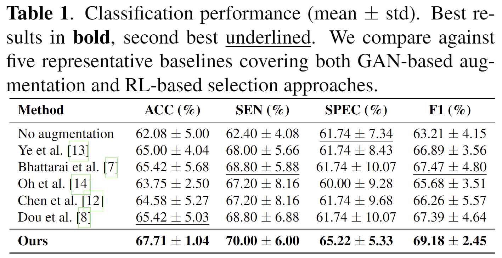
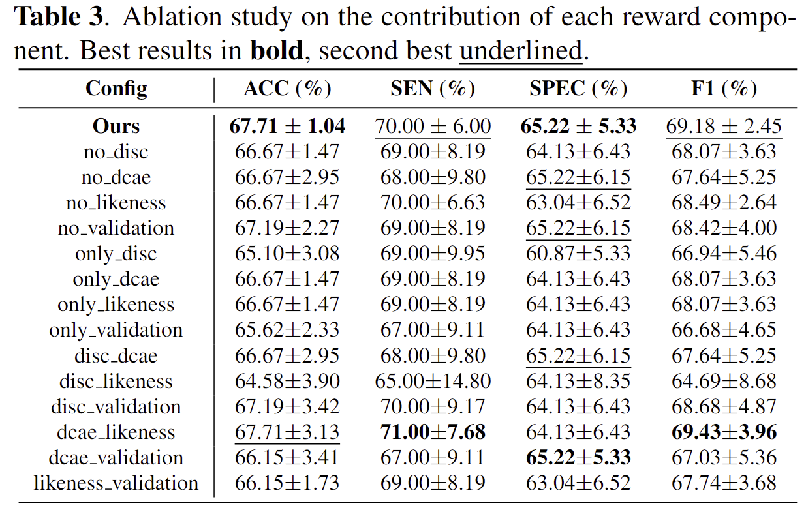
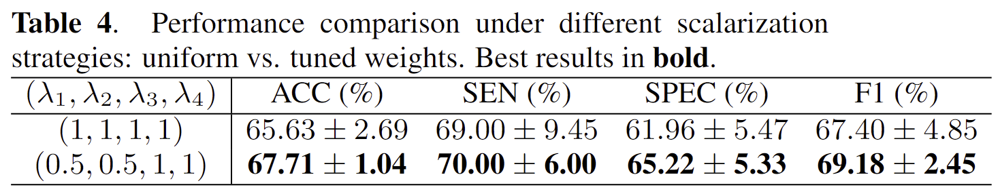
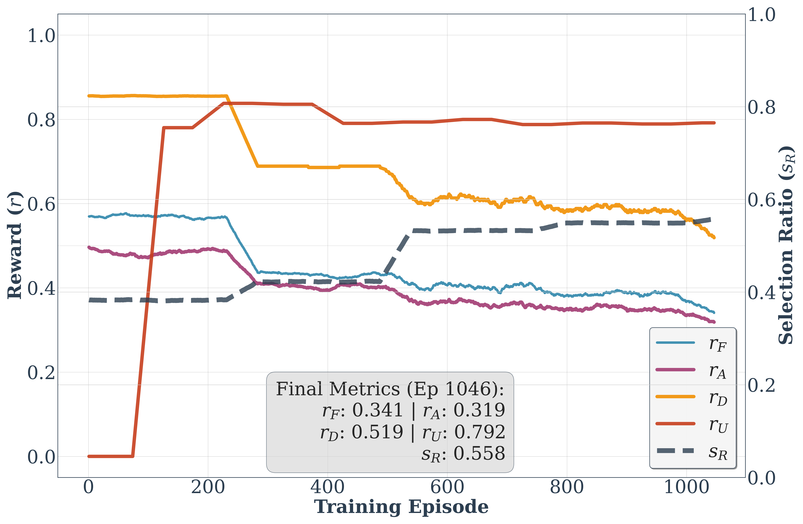

# Reinforcement Learning with Multi Objective Rewards for Functional Connectivity Augmentation

## 📊 Results

We evaluated our framework on the **REST-meta-MDD** dataset using a 5-fold cross-validation scheme. The results demonstrate that our multi-objective RL agent consistently selects high-quality synthetic samples that improve downstream diagnostic performance.

### 1. Comparison with State-of-the-Art Methods
Our method outperforms representative GAN-based augmentation and RL-based selection baselines across all metrics (Accuracy, Sensitivity, Specificity, and F1-score).

  

> **Table 1.** Classification performance comparison. [cite_start]Our method achieves the highest accuracy (**67.71%**) and F1-score (**69.18%**), significantly surpassing the no-augmentation baseline and other competitive methods[cite: 8, 135].

---

### 2. Ablation Studies & Analysis
To validate the effectiveness of our proposed components, we conducted extensive ablation studies.

#### Impact of Reward Components & Selection Strategy
We analyzed the contribution of each reward objective ($r_F, r_D, r_A, r_U$) and compared our policy against heuristic selection strategies (Random, Coverage, Centroid, Fidelity).

  
  

> **Left (Table 3):** Ablation study on the contribution of each reward component. Removing any single objective leads to performance degradation, confirming the necessity of the multi-objective framework[cite: 156, 171].
>  **Right (Table 2):** Performance comparison across different selection methods. Our RL-based approach outperforms fixed heuristic strategies.

#### Impact of Scalarization Strategy
We further investigated the effect of reward scalarization weights on the agent's learning.

  

> **Table 4.** Performance comparison under different scalarization strategies (e.g., uniform vs. tuned weights). Tuned weights that prioritize utility and alignment yield superior diagnostic performance.

---

### 3. Training Dynamics
The following graph illustrates the evolution of reward signals and the selection ratio during training.

  

> **Fig 2.** Temporal dynamics of multi-objective rewards and selection ratio. [cite_start]A three-phase pattern emerges: (1) **Utility ($r_U$)-driven expansion**, (2) **Diversity ($r_D$)-driven coverage**, and (3) **Fidelity/Alignment ($r_F, r_A$)-constrained stabilization**, resulting in a robust selection policy.
