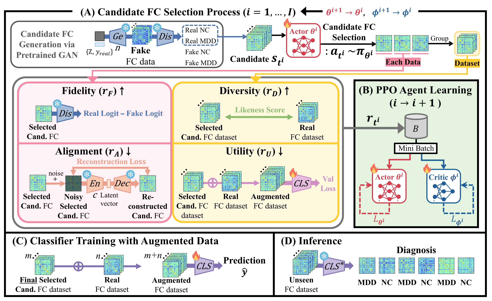
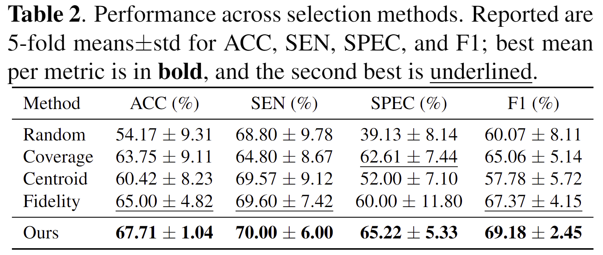
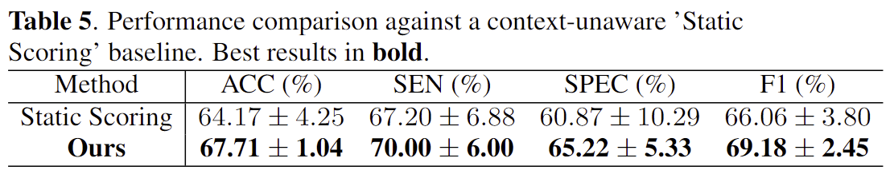

# Reinforcement Learning with Multi Objective Rewards for Functional Connectivity Augmentation

## 📋 Overview

  

    
> **Fig 1.**  This figure presented in the overview comprises four stages: (A) iterative candidate selection guided by a multi-objective reward, (B) agent training of the PPO, (C) classifier training on curated augmentations, and (D) inference on new subjects.

## ⭐ Contributions

(i) **RL-based Synthetic Data Filtering Framework.**  
We propose a reinforcement learning–based synthetic data curation framework that formulates sample selection as a **vector-valued multi-objective reward optimization** problem, and learns a scalarized policy to enable **quality-controlled functional connectivity augmentation** for MDD diagnosis.

(ii) **Interpretable Selection Dynamics Analysis.**  
We introduce an analysis framework that quantifies **selection dynamics** throughout training and connects high-reward synthetic samples to **interpretable functional connectivity motifs**, ensuring transparent and reproducible augmentation.

## 📊 Results

We evaluated our framework on the **REST-meta-MDD** dataset using a 5-fold cross-validation scheme. The results demonstrate that our multi-objective RL agent consistently selects high-quality synthetic samples that improve downstream diagnostic performance.

### 1. Comparison with State-of-the-Art Methods
Our method outperforms representative GAN-based augmentation and RL-based selection baselines across all metrics (Accuracy, Sensitivity, Specificity, and F1-score).

  

> **Table 1.** Classification performance comparison. Our method achieves the highest accuracy (**67.71%**) and F1-score (**69.18%**), significantly surpassing the no-augmentation baseline and other competitive methods.

  

> **Table 1.** Performance across selection methods.

---

### 2. Ablation Studies & Analysis
To validate the effectiveness of our proposed components, we conducted extensive ablation studies.

#### Impact of Reward Components & Selection Strategy
We analyzed the contribution of each reward objective ($r_F, r_D, r_A, r_U$) and compared our policy against heuristic selection strategies (Random, Coverage, Centroid, Fidelity).

  

> **Table 3:** Ablation study on the contribution of each reward component. Removing any single objective leads to performance degradation, confirming the necessity of the multi-objective framework[cite: 156, 171].

#### Impact of Scalarization Strategy
We further investigated the effect of reward scalarization weights on the agent's learning.

  

> **Table 4.** Uniform linear scalarization(lambda_{all}=1.0) reduces F1 by 1.8% and doubles variance(std 2.45 to 4.85), as dense structural rewards(r_F,r_A) overshadow sparse utility reward(r_U), biasing optimization toward easier objectives. Prioritizing primary targets(lambda=1.0) over regularizers(lambda=0.5) balances learning, achieving the highest Accuracy(67.71%) and Stability(std: 1.04).

  

> **Table 5.** Compared to a context-unaware "Static Scoring" baseline(selecting features independently), our RL framework improved F1 by 3.1%. The agent analyzes functional connectivity(s_t) to identify redundancy, mitigating mode collapse and ensuring diversity crucial for robust diagnostic generalization. 

---

### 3. Training Dynamics
The following graph illustrates the evolution of reward signals and the selection ratio during training.

  

> **Fig 2.** Temporal dynamics of multi-objective rewards and selection ratio. [cite_start]A three-phase pattern emerges: (1) **Utility ($r_U$)-driven expansion**, (2) **Diversity ($r_D$)-driven coverage**, and (3) **Fidelity/Alignment ($r_F, r_A$)-constrained stabilization**, resulting in a robust selection policy.
